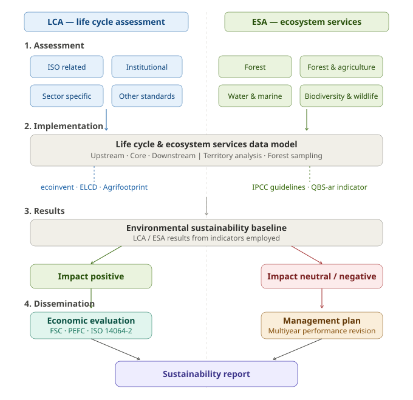
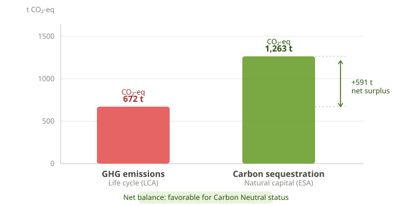

# TREEIN Framework — TREe Model for Environmental Impact Neutrality

[](https://creativecommons.org/licenses/by/4.0/)
[](https://doi.org/10.1002/csr.2879)
[](https://onlinelibrary.wiley.com/journal/csr)
[](https://www.nbfc.it/)

---

## Overview

This repository contains the documentation and supplementary materials for the **TREEIN** framework, presented in:

> **Varavallo, G., Rugani, B., Allocco, M., Barbera, F., & Calfapietra, C. (2024).** *Tree-based model for achieving environmental impact neutrality: A case study application in the agri-food sector.* Corporate Social Responsibility and Environmental Management, 31(6), 5557–5573. https://doi.org/10.1002/csr.2879

**TREEIN** ("a **TRE**e model for **E**nvironmental **I**mpact **N**eutrality") is an environmental sustainability management framework designed to guide agri-food organizations toward **environmental impact neutrality** by integrating Life Cycle Assessment (LCA) and Ecosystem Services Assessment (ESA) methodologies within a single structured protocol.

The framework was developed over approximately 18 months in collaboration with [SEAcoop STP](https://tinyurl.com/ReportArgiano) (Turin, Italy) and funded by the **National Biodiversity Future Centre (NBFC)**, under Italy's PNRR program (Grant CN00000033).

---

## Research Context

Agriculture and forestry account for roughly 30% of global anthropogenic greenhouse gas emissions, 70% of all water withdrawals, and are a primary driver of biodiversity loss. Despite the proliferation of sustainability certification schemes, no consensus currently exists on how organizations should offset their residual environmental footprint.

TREEIN addresses this gap by providing a **decision-tree protocol** that:
- Maps existing LCA and ESA certification schemes onto a structured assessment process
- Integrates both the **negative impacts** of a production system's life cycle and the **positive impacts** offered by ecosystem services
- Guides organizations from environmental baseline measurement to certified impact neutrality

The framework was validated through a real-world case study of **Argiano s.r.l.** (Montalcino, Tuscany), a wine and extra-virgin olive oil producer belonging to the "Brunello di Montalcino" appellation.

---

## The TREEIN Framework

TREEIN is structured around four interconnected phases, with LCA and ESA schemes running in parallel through the Assessment stage and converging into a unified data model at Implementation:



---

## Methodology

The research combined three analytical approaches:

**Literature review** — systematic review of LCA and ESA frameworks and their integration, covering models from Köllner et al. (2013) through Taelman et al. (2024).

**Multiple Correspondence Analysis (MCA)** — applied to 18 European sustainability programs in the wine and extra-virgin olive oil sectors across 5 analytical dimensions (agri-food sector, country, certification objective, sustainability pillars, combined LCA-ESA approach). MCA revealed that the majority of European programs do not currently employ a combined LCA-ESA approach, underscoring the need for TREEIN.

**Case study application** — TREEIN was operationalized at Argiano s.r.l. (Tuscany, Italy), integrating:
- Carbon footprint LCA of wine (0.75 L bottle) and extra-virgin olive oil (1 L) production lines
- In-situ forest carbon stock measurement across 5 sampling areas
- Soil biodiversity assessment using the QBS-ar indicator

---

## Case Study: Argiano s.r.l. — Key Results

TREEIN was applied to Argiano s.r.l. (Montalcino, Tuscany), a wine and extra-virgin olive oil producer. The LCA covered the 2020 production year; the ESA assessed forest carbon stock across five in-situ sampling areas. The annual carbon balance shows that natural capital sequestration exceeds total life cycle emissions, placing Argiano in a favorable position for certified **Carbon Neutral** status.



Per-product footprints: **2.3 kg CO₂-eq.** per 0.75 L wine bottle and **3.3 kg CO₂-eq.** per litre of extra-virgin olive oil. The existing carbon stock in woody plants and soils stands at approximately 62,072 t CO₂-eq., with an estimated annual value of ~3.2 M€. Transitioning to photovoltaic electricity could further reduce the carbon footprint by ~18% for wine and ~28% for olive oil.

---

## Sustainability Programs Analyzed

The MCA analysis covered 18 European sustainability programs in the wine and extra-virgin olive oil sectors, including:

`Biodiversity Friend` · `DTP125` · `EcoProWine` · `Equalitas` · `FAIR and GREEN` · `FairChoice` · `HAproWINE` · `Ita.ca/Gea.vite` · `Made Green Italy` · `Magis` · `NewGreenRevolution` · `SOStain` · `SQNPI` · `Sustainable Austria` · `Terra Vitis` · `VDD` · `Vino Libero` · `VIVA`

Programs were evaluated across five dimensions: agri-food sector, country, certification objective (enterprise/product), sustainability pillars (environmental/social/economic), and combined LCA-ESA approach.

---

## Certification Schemes Covered

TREEIN maps and integrates certifications across two methodological families:

**LCA-based** — ISO 14001/14044, ISO 9001, ISO 5001, PEF, OEF, EMAS, EPR (2018/851), GRI 305, PAS 2060:2014, Cradle to Cradle (C2C)

**ESA-based** — Natural Capital Protocol (NCP), FSC, PEFC, Rainforest Alliance, MSC, Alliance for Water Stewardship (AWS), WFEN, Bird Friendly Coffee, FairTrade

**Both** — IPCC 2006/2019 Guidelines for National GHG Inventories

---

## Citation

If you use this framework or find this work useful, please cite:

```bibtex
@article{varavallo2024treein,
  title     = {Tree-based model for achieving environmental impact neutrality:
               A case study application in the agri-food sector},
  author    = {Varavallo, Giuseppe and Rugani, Benedetto and Allocco, Marco
               and Barbera, Filippo and Calfapietra, Carlo},
  journal   = {Corporate Social Responsibility and Environmental Management},
  volume    = {31},
  number    = {6},
  pages     = {5557--5573},
  year      = {2024},
  publisher = {Wiley},
  doi       = {10.1002/csr.2879}
}
```

---

## Authors

**Giuseppe Varavallo** — Department of Cultures, Politics and Society & Department of Economics and Statistics "Cognetti de Martiis", University of Turin
✉ giuseppe.varavallo@unito.it

**Benedetto Rugani** — National Research Council of Italy (CNR), Research Institute on Terrestrial Ecosystems (IRET) & National Biodiversity Future Centre (NBFC)

**Marco Allocco** — SEAcoop STP, Turin

**Filippo Barbera** — Department of Cultures, Politics and Society, University of Turin & Collegio Carlo Alberto

**Carlo Calfapietra** — National Research Council of Italy (CNR), Research Institute on Terrestrial Ecosystems (IRET) & National Biodiversity Future Centre (NBFC)

---

## Funding

This research was supported by the **National Biodiversity Future Centre (NBFC)**, funded by the Italian Ministry of University and Research under P.N.R.R., Missione 4 Componente 2 — *"Dalla ricerca all'impresa"*, Investimento 1.4, Grant/Award Number: **CN00000033**.

---

## License

This work is licensed under the [Creative Commons Attribution 4.0 International License (CC BY 4.0)](https://creativecommons.org/licenses/by/4.0/).
